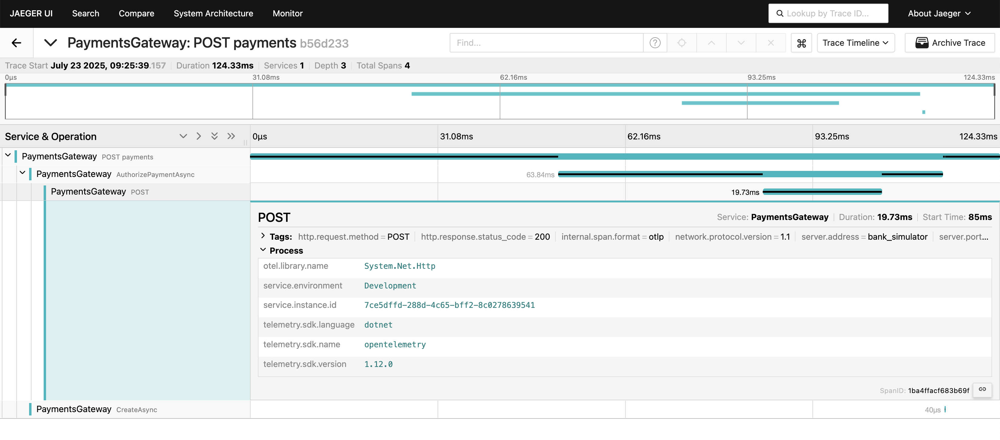

# Payments Gateway

This repository contains the source code to a Payment Gateway used to enable e-commerce merchants to take payments from customers. The gateway is a REST API is written in C# using .NET 8, currently backed by an in-memory database and Bank simulator.

## Contents

- [Contents](#contents)
- [Prerequisites](#prerequisites)
- [Running locally](#running-locally)
- [Tests](#tests)
    - [Integration tests](#integration-tests)
- [Observability](#observability)
- [Improvements](#improvements)

## Prerequisites

- [.NET SDK](https://dotnet.microsoft.com/en-us/download/dotnet/8.0)
- [Docker](https://docs.docker.com/engine/install/)

## Running Locally

This project has been built to be easily run locally, by using Docker Compose. By running the following command, the project will be built and started.

```shell
docker compose up -d
```

Or optionally, to rebuild the API:

```shell
docker compose up -d --build
```

Alternatively, to aid debugging and development, you can run this Docker Compose command to spin up the dependencies only, then use your IDE to start the API using the [launchSettings.json](Properties/launchSettings.json).

```shell
docker compose up jaeger bank_simulator -d
```

While running in either manner, you can go to [http://localhost:16686](http://localhost:16686) to view traces in Jaeger.

## Tests

The Payment Gateway has been built with a TDD approach and includes projects for both unit and integration tests. The `Payments.Tests` project contains a number of unit tests which over small and isolated units of code, typically at a lower level of detail too, such as specific validation cases. Alongside this, the `Payments.IntegrationTests` project contains a number of tests used to test the API endpoints in specific ways, which covers the full flow and integration with the Bank. 

### Integration Tests

As the above, we use a number of integration tests in this project used to test the API's endpoints. These tests aim to ensure that a client (tests) can successfully send requests to the Payment Gateway, the gateway can successfully communicate and understand the Bank, and that payments are stored correctly.

The `Payments.IntegrationTests` project contains a test fixture which has a one-time setup that uses [Testcontainers](https://testcontainers.com/) to start Docker containers for both the Payment Gateway API and Bank Simulator. This setup is run at the start of a test session, then the containers are stop and removed at the end of the tests.

## Observability

The Payment Gateway is instrumented with [OpenTelemetry](https://opentelemetry.io/) which provides traces and metrics for various operations. These start at the top-level with API requests, but have been instrumented further down to cover downstream HTTP requests and data-access operations.

In this project I have used opted to use the `System.Dianostics` API for custom instrumentation as it a common API that doesn't tie the implementation to OpenTelemetry. However, it can be useful to use the OpenTelemetry tracing SDK directly if you wanted to make use of specific OpenTelemetry features or have the OpenTelemetry language in the code.

Below is an image showing a trace for a process payment request. You can see detail on the downstream request to the Bank and also the small trace for saving the record.



## Improvements

Below are a number of improvements that could be made to this project.

1. **Use an external, distributed database.** The current solution is implemented using an in-memory collection for persisting payment records, which will cause issues at scale as data could not be shared between replicas and will require sufficient memory resource. In addition to the scaling issues, the data is persisted in a volatile way and will be lost if the container restarts.
2. **Authentication.** Currently, the solution has no form of authentication and if it was hosted on the internet, anyone would be able to use the service to take a payment. If authentication was implemented we could provide specific downstream bank solutions for each merchant and understand usage patterns of specific upstream clients.
3. **GitHub Actions & CI/CD.** If this solution was to be used in production, it would be ideal to introduce some CI/CD pipelines to allow seamless releases followed by ensuring the automated tests pass. Actions could also be introduced to run the tests on Pull Requests to ensure broken code doesn't enter the project.
4. **Support multiple acquiring banks.** Following from a point around authentication, it might be a good idea to enable the gateway to support multiple banks to give merchants the option of bank to use or even switch based on the card. To make the right call here would depend on specific domain knowledge and requirements. 